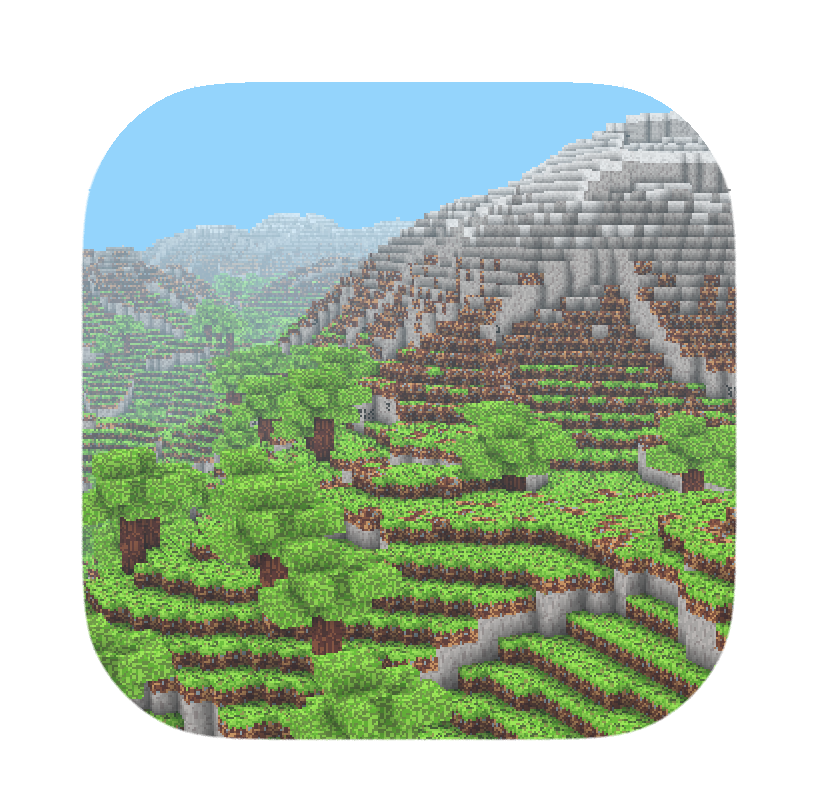

# ubiquitous-cube-game
A Minecraft clone implementation in Python using modern OpenGL.

<p align="center">



</p>

## Project Goal

The goal of this project is to create a simple Minecraft clone written in Python that can run on Windows 11 and macOS.

## Installation

Requirements:
- 🐍 Python 3.13+ installed (As of May 2025)
- ⚙️ GPU capable of OpenGL 3.3+

Next, clone the repository to your local machine:
```zsh
git clone https://github.com/Xata/ubiquitous-cube-game.git
```

Navigate into the project directory:
```zsh
cd ubiquitous-cube-game
```

Create a virtual environment with venv:
```zsh
python -m venv .venv
```

⚠️ Be sure to activate the virtual environment before the next step!

⚠️ On Windows 10/11 you may need to change the execution policy of scripts by running:
```powershell
Set-ExecutionPolicy -ExecutionPolicy RemoteSigned -Scope Process
```

Install the dependencies:
```zsh
pip install -r requirements.txt
```

## Running the game
Once installed run the game:
```zsh
python main.py
```

## Gameplay

Below you can find a picture of a house built with the current blocks:


The current controls are:

| Key | Action |
|------|--------|
| W | Move Forward |
| S | Move Backward |
| A | Move Left |
| D | Move Right |
| Q | Move Up |
| E | Move Down |
| Left Mouse Btn | Block Action |
| Right Mouse Btn | Change block Action |
| Middle Mouse Btn | Change active block to place |
| ESC | Exit |

Note: To change the block you need to place press the middle mouse button. The selected block will be printed in the console.

### Available blocks
The blocks below are defined in app.blocks.block_type.py!


The current blocks that are placeable are:

| Block name           | Block ID |
|----------------------|----------|
| VOID                 | 0        |
| SAND                 | 1        |
| GRASS                | 2        |
| DIRT                 | 3        |
| STONE                | 4        |
| SNOW                 | 5        |
| LEAVES               | 6        |
| WOOD                 | 7        | 
| COAL_ORE             | 8        |
| RAW_COAL_BLOCK       | 9        |
| COPPER_ORE           | 10       |
| RAW_COPPER_BLOCK     | 11       | 
| TIN_ORE              | 12       |       
| RAW_TIN_BLOCK        | 13       |       
| WOOD_BLOCK           | 14       |   
| BASIC_CRAFTING_TABLE | 15       |

Generates a random world each time using 

There is also ore generation within the cave systems:


## Credits

The following was used to create the base game:

- 
- 
- 
- 
- 
- 
